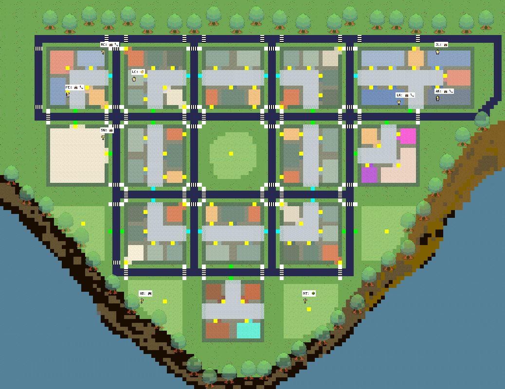

# MobileCity
<p align="center" width="100%">

</p>
MobileCity is a lightweight simulation platform based on a tilebased city representation. The project goal is to generate agent behaviors in the virtual City. This repository accompanies our research paper titled: 

[MobileCity: An Efficient Framework for Large-Scale Urban Behavior Simulation](https://arxiv.org/abs/2504.16946)

## How to run the simulation
### 1 Install dependencies
Install libraries listed in `requirements.txt`.

### 2. Run simulation in the backend
If you just want to run the demo of previous experiments, jump to Step 3.

#### 2.1 Start simulation
In `backend_server`, run the following command:
```
python reverie.py --start_date <Start date> --agent_num <Number of agents> --max_step <Maximum steps> --max_api <Maximum concurrent API requests> -- is_generate_agent_memory <Whether generate agent memories or not>
```
For example,
```
python reverie.py --start_date 20250908 --agent_num 10 --max_step 5760 --max_api 1 -- is_generate_agent_memory False
```

#### 2.2 Check the output
The output of your experiment is stored in `frontend_server/storage/<simcode>/output`.

Files in `traffic` recorded the traffic flow in map sectors in each hour.\
`actions.json` recorded the agent actions, and the changes in their basic needs.

### 3. Run visualization in the frontend
To visualize an existed experiment, run the following command:
```
SIMCODE=<A existed experiment> python manage.py runserver 8001
```
Go to [the simulation web page](http://localhost:8001/home/) and you can see the simulation.

### 4. Fake data
To protect user data privacy, we have applied data obfuscation to the users' actual data in `character/wbprofile_example.csv`, `character/actions/sunny_choice_filtered.csv`, and `character/actions/rainy_choice_filtered.csv`.

If you want to generate action memories, please modify your endpoint urls in Line 45 and Line 67 in `agent_memory.py`.